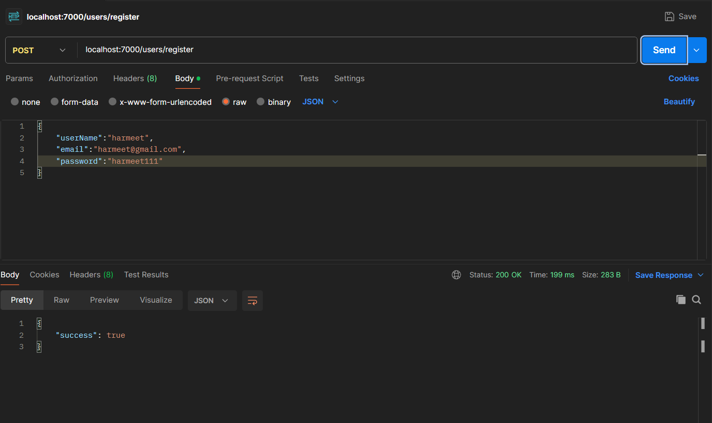
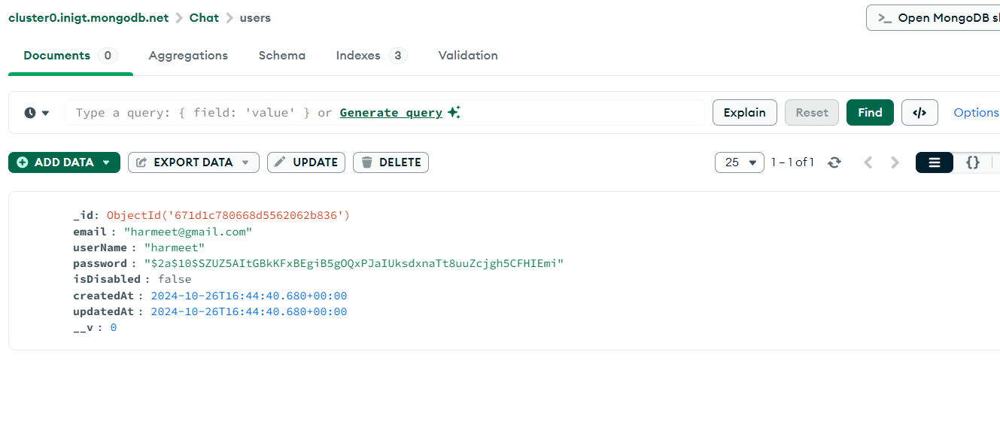

# Chat Application

## How to run

1. **Clone the repository:**
   ```bash
   git clone <repository-url>
   cd chat
   ```

2. **Install dependencies**:
   Use Yarn to install dependencies specified in `package.json`.
   ```bash
   npm install
   ```

3. **Environment Variables**:
   - Ensure you have a `.env` file in the `src/Config` directory, as indicated by the `cp-files` script in `package.json`. This file should include MongoDB connection URI, JWT secret keys, and other necessary configurations.
   - Example:
     ```plaintext
     PORT= <PORT>
     NODE_ENV= development
     MONGODB_URI=<your_mongo_uri>
     JWT_SECRET=<your_jwt_secret>
     JWT_EXPIRE=15d
     ```

4. **Compile TypeScript**:
   ```bash
   yarn build
   ```

5. **Run the Application**:
   To start the server:
   ```bash
   yarn start
   ```

   Alternatively, for development with hot reloading:
   ```bash
   yarn dev
   ```

## Scripts

- `yarn start`: Runs the application from the compiled `dist` directory.
- `yarn dev`: Starts the application in development mode with `nodemon` and TypeScript support.
- `yarn build`: Compiles TypeScript files and prepares the build directory.
- `yarn clean`: Removes the `dist` directory.
- `yarn release`: Creates a new release version using `standard-version`.


```markdown

## Project Structure
chat/
├── .gitignore               # Specifies files to ignore in version control
├── .npmrc                   # Configurations for npm (or Yarn) package manager
├── .vscode/                 # Visual Studio Code workspace settings (optional)
├── package.json             # Project metadata, dependencies, and scripts
├── package-lock.json        # Lockfile for precise dependency versions
├── README.md                # Project documentation (setup, usage, testing)
├── src/                     # Source code folder
│   ├── Config/              # Configuration files (e.g., environment variables)
│   │   └── config.env       # Environment configuration file (example)
│   ├── server.ts            # Main server file (entry point)
│   ├── <other-modules>.ts   # Additional TypeScript files for app modules
├── tsconfig.json            # TypeScript configuration file
└── dist/                    # Compiled output directory (generated after build)


```


## Assumptions

1. **Environment Configuration**: It is assumed that `.env` configuration is set correctly for MongoDB and other services.
2. **WebSocket Support**: The application includes WebSocket functionality with `Socket.io` to handle real-time messaging.
3. **Database**: The application uses MongoDB for data persistence. Ensure MongoDB is running and accessible.

## Testing WebSocket Functionality

1. **Starting the Server**:
   Make sure the server is running (`yarn start` or `yarn dev`) to initialize WebSocket connections.

2. **WebSocket Client**:
   Use a WebSocket client (e.g., [Postman WebSocket](https://learning.postman.com/docs/sending-requests/websocket/) or a simple web client) to connect to the server's WebSocket endpoint, which is typically at `ws://localhost:<port>` (replace `<port>` with the server’s port).
---


### User Management
1. Register




2. Password Bcrypt


3. Password Error


4. User Already Exist


5. Login


6. Email not Found


7. Login invalid credentials


8. Get User with JWT


### Chats

1. Chat between two users


2. Chat between two users already exist


3. Get chats


4. Get Chat by Id


### Messaging

1. Send a message


1. Message pagination


